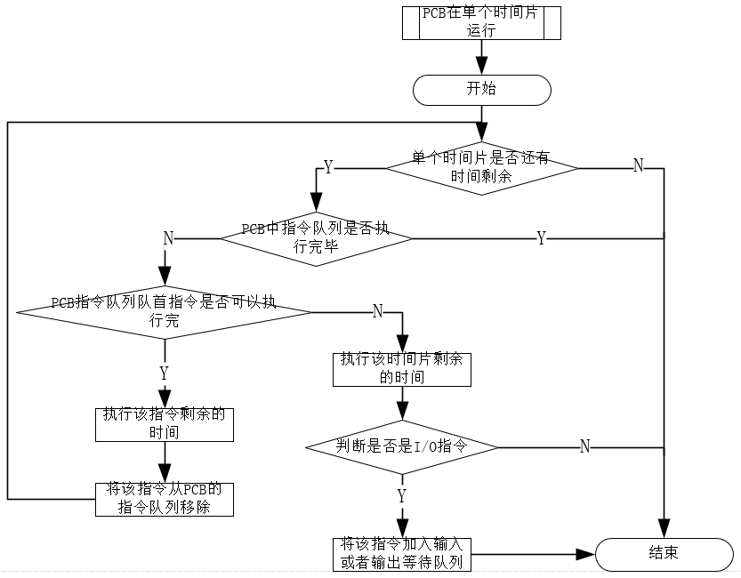

# 时间片轮转调度算法实现

## 一、算法原理
系统的进程调度，最简单也是最常用的是基于时间片的轮转（round robin, RR）调度算法。该算法采取了非常公平的处理机分配方式，即让就绪队列上的每个进程每次仅运行一个时间片。那么如果就绪队列上有 n 个进程，则每个进程每次大约都可获得1/n 的处理机时间。
	轮转调度算法的基本原理如下：
	在轮转法中，系统根据先来先服务（FCFS）的策略，将所有的就绪进程排成一个队列，并可设置每个一定时间间隔（如30 ms）即产生一次中断，激活系统中的进程调度程序，完成一次调度，将 CPU 分配给新的队首进程，令其执行。当该进程的时间片耗尽或运行完毕时，系统再次将CPU分配给新的队首进程（或新的到达的紧迫进程）。由此，可保证就绪队列中的所有进程在一个确定的时间段内，都能够获得一次CPU的执行。在RR调度算法中，进程切换的情况分为两种：1、若一个时间片尚未用完，正在运行的进程便已经完成，就立即激活调度程序，将它从就绪队列中删除，再调度就绪队列中的队首进程运行，并启动一个新的时间片；2、在一个时间片用完时，计时器中断处理程序被激活。如果进程尚未运行完毕，调度程序将把它送往就绪队列的末尾。

## 二、数据结构

## 三、实现流程

## 四、效果展示

